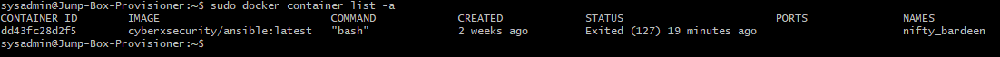
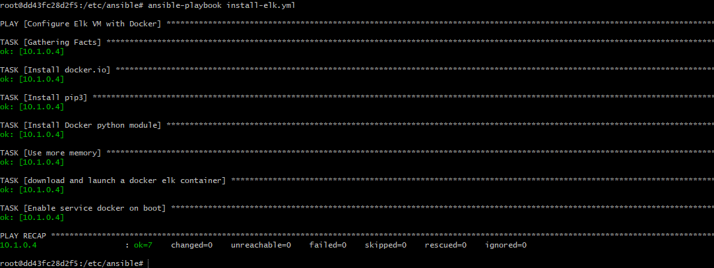
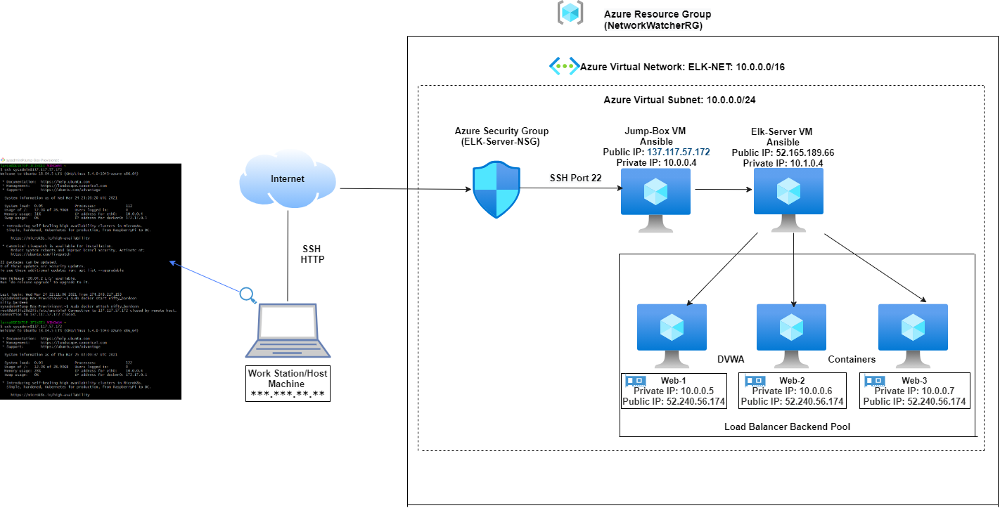

# Project-13
Automated ELK Stack Deployment - Azure

## Automated ELK Stack Deployment

The files in this repository were used to configure the network depicted below.

[Cloud Security Diagram](https://github.com/AndreaMLarson/Project-13/blob/main/Diagrams/Cloud-Security-Diagram.png)

These files have been tested and used to generate a live ELK deployment on Azure. They can be used to either recreate the entire deployment pictured above. Alternatively, select portions of the yml file may be used to install only certain pieces of it, such as Filebeat.

This document contains the following details:
- Description of the Topology
- Access Policies
- ELK Configuration
  - Beats in Use
  - Machines Being Monitored
- How to Use the Ansible Build

### Description of the Topology

The main purpose of this network is to expose a load-balanced and monitored instance of DVWA, the D*mn Vulnerable Web Application.

Load balancing ensures that the application will be highly available, performant, and secure, in addition to restricting traffic to the network.
- _TODO: What aspect of security do load balancers protect? What is the advantage of a jump box?_
A load balancer receives traffic that comes into the website and distributes it across multiple servers to "balance" the "load" that is put on each server. +++Load balancers offer a health probe function to regularly check all the machines behind the load balancer. Machines with issues are reported, and the load balancers stop sending traffic to those machines. Load Balancers also help distribute traffic evenly across the servers and mitigates DoS attacks.

Integrating an ELK server allows users to easily monitor the vulnerable VMs for changes to the logs and system files.
- _TODO: What does Filebeat watch for?_   
  - Filebeat is a lightweight shipper for forwarding and centralizing log data. It monitors the log files, (or designated locations) collects log events, and forwards them to Elasticsearch for indexing.
- _TODO: What does Metricbeat record?_
  -  Metricbeat is a lightweight shipper that collects metrics from the operating system and from services running on the server (such as "up-time", CPU usage, and memory usage) and ships these metrics to Elasticsearch.

The configuration details of each machine may be found below.
_Note: Use the [Markdown Table Generator](http://www.tablesgenerator.com/markdown_tables) to add/remove values from the table_.

| Name       | Function    | IP Address | Operating System |
|------------|-------------|------------|------------------|
| Jump Box   | Gateway     | 10.0.0.4   | Linux            |
| Web-1      | Client      | 10.0.0.5   | Linux            |
| Web-2      | Client      | 10.0.0.6   | Linux            |
| Web-3      | Client      | 10.0.0.7   | Linux            |
| Elk-Server | Client      | 10.1.0.4   | Linux            |

### Access Policies

The machines on the internal network are not exposed to the public Internet.

Only the Jump-Box machine can accept connections from the Internet. Access to this machine is only allowed from the workstation IP address. (Home network IP in this scenario.)

Machines within the network can only be accessed by ssh from the Jump-Box virtual machine.
- _TODO: Which machine did you allow to access your ELK VM? What was its IP address?_
  - Workstation Public IP

A summary of the access policies in place can be found in the table below.

| Name     | Publicly Accessible | Allowed IP Addresses  |
|----------|---------------------|-----------------------|
| Jump Box | Yes                 | Workstation Public IP |
| ELK      | No                  | 10.1.0.0-254          |
| Web-1    | No                  | 10.0.0.1-254          |
| Web-2    | No                  | 10.0.0.1-254          |
| Web-3    | No                  | 10.0.0.1-254          |

### Elk Configuration

Ansible was used to automate configuration of the ELK machine. No configuration was performed manually, which is advantageous because...
- _TODO: What is the main advantage of automating configuration with Ansible?_
  - The main advantage is configuration management and provisioning

The playbook implements the following tasks:
- _TODO: In 3-5 bullets, explain the steps of the ELK installation play. E.g., install Docker; download image; etc._
  - Install docker.io
  - Install pip3
  - Install docker python module
  - Increase and set memory to 262144
  - Download and launch the docker ELK container:761

The following screenshot displays the result of running `docker ps` after successfully configuring the ELK instance.

### Target Machines & Beats
This ELK server (IP 10.1.0.4) is configured to monitor the following machines:
- _TODO: List the IP addresses of the machines you are monitoring_
  - Web-1: 10.0.0.5
  - Web-2: 10.0.0.6
  - Web-3: 10.0.0.7
  - ELK Server: 10.1.0.4

We have installed the following Beats on these machines:
Filebeat
Metricbeat

These Beats allow us to collect the following information from each machine:
Filebeat: collects and ships log files to Elasticsearch for indexing.
Metricbeat: collects metrics from the operating system and from services running on the server (such as "up-time", CPU usage, and memory usage) and ships these metrics to Elasticsearch.

[ELK Stack Diagram](https://github.com/AndreaMLarson/Project-13/blob/main/Diagrams/ELK-Stack.png)

### Using the Playbook
SSH into the control node and follow the steps below:
- Copy the playbook file to /etc/Ansible
- Update the hosts file to include VMs IP Addresses:
10.0.0.7 ansible_python_interpreter=/usr/bin/python3
10.0.0.6 ansible_python_interpreter=/usr/bin/python3
10.0.0.5 ansible_python_interpreter=/usr/bin/python3

- Run the playbook, and navigate to the ELK Server (IP 10.1.0.4) and run curl localhost/setup.php to check that the installation worked as expected.

_TODO: Answer the following questions to fill in the blanks:_
- Which file is the playbook?
  - Ansible-playbook.yml
- Where do you copy it?
  - /etc/ansible

- _Which file do you update to make Ansible run the playbook on a specific machine? How do I specify which machine to install the ELK server on versus which to install Filebeat on?_
  - It is updated on the hosts file. Add a group called "elk" into web servers followed by the IP address for the ELK Server (IP 10.1.0.4) /ansible/hosts.txt
      - 
- _Which URL do you navigate to in order to check that the ELK server is running?
  - Kibana Application http://52.165.189.66:5601/

_As a **Bonus**, provide the specific commands the user will need to run to download the playbook, update the files, etc._
  - ansible-playbook *.yml nano hosts nano ansible.cfg nano *.yml
